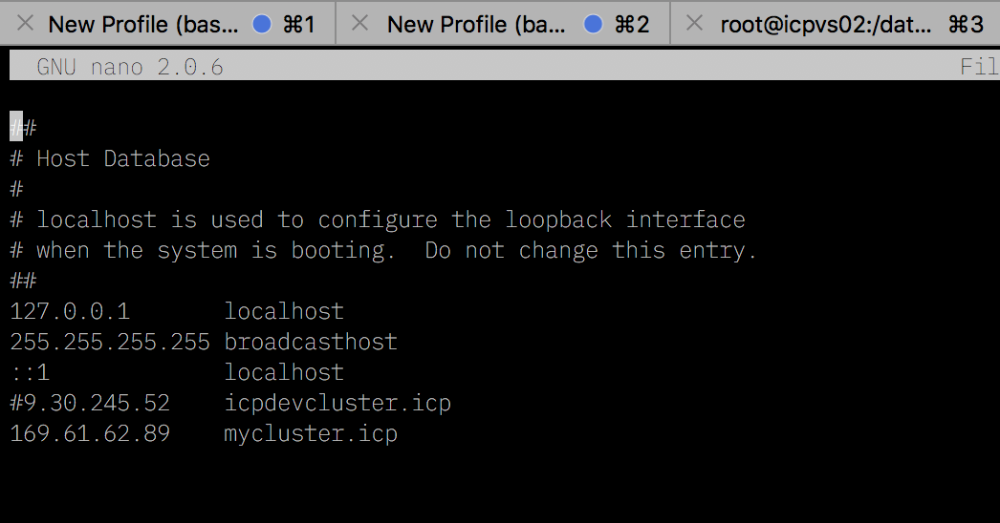

# Documentation

#  Cumulus Bank
<h1 align="center">
  <br>
      Banking Application based on IBM Cloud Private 
  <br>
  <br>
</h1>

<h4 align="center">Powered by IBM Cloud Private</h4>

<p align="center">
  <a>
    
  </a>
</p>
<br>

# Building an Airline Booking Application based on Microservices Architecture on IBM Cloud Private
### Introduction

In this Code Pattern, we will build a cloud native application based on microservice architecture, IBM Middlewares and following 12 factor practices. This application is an Airline Booking app, and the technologies behind this app are:- 
* Nodejs (Typescript)
* IBM ODM
* MariaDB
* MongoDB
* Angular
* Docker
* Kubernetes 
* IBM Cloud Private
* Istio
* Calico

Cloud native application is a buzzword these days. Technologies like Kubernetes and Docker are picking up reputation and popularity in Cloud native world. This Pattern will show an end to end process of building highly available Cloud Native Application on IBM Cloud Private. The Application backend is based on Nodejs , MariaDB, MongoDB as a Database. Buisness rules are created using ODM. The mobile app is built using Ionic.

### Learning objectives
When you've completed this Code Pattern, you will understand how to:

* Break the application into different microservices
* Deploying microservices based application on IBM Cloud Private
* Leveraging IBM Middlewares such as ODM on Kubernetes
* Using Istio to build service mesh
* Using Grafana, Prometheus, kiali, and Weavnet for visualisation 
* Securing kubernetes networking through Calico
* Designing business rules and decision by IBM ODM
* Leveraging  MariaDB, and MongoDB as backend data storage
* Learn how to use IBM Cloud Private, Docker, and Kubernetes
* Creating Ionic Mobile App
### App Screenshot

  

#### Flow
1. *Mobile App*:- End user mobile app who will access the application. It leverages restful endpoints by backend microservices
2. *Authentication Microservice*:- This Microservice allows the user to login signup to the application 
3. *Bills and Payment Microservice*:- This Microservice allows the user to pay the bills and history
4. *Ai Microservice*:- This Microservice allows the user to interact with Watson Assistant 
5. *Sms Microservice*:- This Microservice allows the user to send sms for each bills 
6. *Offers Microservice*:- This Microservice helps to communicate with the ODM Service
7. *MongoDB*:- NOSQL Database for listing microservice
8. *MariaDB*:- NOSQL Database for booking microservice
9. *ODM*:- IBM Operational Decision Manager is an advanced business rules management system that helps you capture, automate and govern frequent, repeatable business decisions and adds real-time decision making to your day-to-day operations


 #### Featured technologies
1. [Angular](https://angular.io/):- Angular is a platform that makes it easy to build applications with the web. Angular combines declarative templates, dependency injection, end to end tooling, and integrated best practices to solve development challenges
2. [Nodejs](https://nodejs.org/en/):- An open-source JavaScript run-time environment for executing server-side JavaScript code.
3. [Typescript](https://www.typescriptlang.org/):- TypeScript is an open-source programming language developed and maintained by Microsoft. It is a strict syntactical superset of JavaScript, and adds optional static typing to the language
4. [Docker](https://www.docker.com/):- Docker is an open platform for developers and sysadmins to build, ship, and run distributed applications, whether on laptops, data center VMs, or the cloud.
5. [Kubernetes](https://kubernetes.io/):- Kubernetes is an open-source system for automating deployment, scaling, and management of containerized applications
6. [IBM ODM](https://www.ibm.com/ae-en/marketplace/operational-decision-manager):- IBM® Operational Decision Manager is a comprehensive decision automation platform that helps you capture, analyze, automate and govern rules-based business decisions
7. [Ionic Cross Platform Mobile App](https://ionicframework.com):- Ionic’s open source Framework and developer-friendly tools and services power apps for some of the world’s best-known brands - from highly successful consumer apps like Sworkit, Untappd and Dow Jones MarketWatch, to mission-critical apps supporting Nationwide, Amtrak, and NASA.
8. [MongoDB](https://www.mongodb.com):- MongoDB is a cross-platform document-oriented database program. It is issued under the Server Side Public License version 1, which was submitted for certification to the Open Source Initiative but later withdrawn in lieu of SSPL version 2
9. [MariaDB](https://mariadb.com):- MariaDB is a community-developed fork of the MySQL relational database management system intended to remain free under the GNU GPL. Development is led by some of the original developers of MySQL
10. [Istio](https://istio.io):- Istio is an open source independent service mesh that provides the fundamentals you need to successfully run a distributed microservice architecture
11. [Weavenet](https://www.weave.works):- visualising kubernetes cluster

## Deploy to IBM Cloud Private

### Pre-req installation 
1. Install [Nodejs](https://nodejs.org/en/download/)
2. Install [Kubectl](https://kubernetes.io/docs/tasks/tools/install-kubectl/)
3. Intall [Docker](https://docs.docker.com/install/)
4. Install [Ionic](https://ionicframework.com)

### Connect Docker (Private registery) with IBM Cloud Private
1. From your terminal type
```
$ sudo nano /etc/hosts
```


2. Type in your ICP ip and provide a dns name, quit and save the file
3. Go to Docker prefernces


4. Navigate to Daemon tab, click on + button underneath insecure registry and add an entry “<icpdns>:8500”, click Apply & Restart button to restart Docker service. 


5. In your terminal type
```
$ docker login <icpdns>:8500
```

### Important note
 * Each microservices has it own repo*

### Install all dependencies, create images and upload it to Private registery of IBM Cloud Private
1. Authentication Microservice
```s
$ cd Authentication-microservice
$ npm i
$ docker build -t authentication-microservice  --no-cache .
$ docker tag authentication-microservice  <icpdns>:8500/default/authentication-microservice 
$ docker push <icpdns>:8500/default/authentication-microservice 
```
2. Accounts Microservice
```s
$ cd Accounts-microservice
$ npm i
$ docker build -t accounts-microservice  --no-cache .
$ docker tag accounts-microservice  <icpdns>:8500/default/accounts-microservice 
$ docker push <icpdns>:8500/default/accounts-microservice 
```
3. SMS Microservice
```s
$ cd SMS-microservice
$ npm i
$ docker build -t sms-microservice  --no-cache .
$ docker tag sms-microservice  <icpdns>:8500/default/sms-microservice 
$ docker push <icpdns>:8500/default/sms-microservice 
```
4. AI Microservice
```s
$ cd AI-microservice
$ docker build -t ai-microservice  --no-cache .
$ docker tag ai-microservice  <icpdns>:8500/default/ai-microservice 
$ docker push <icpdns>:8500/default/ai-microservice 
```

5. Odm Microservice
```s
$ cd odm-microservice
$ npm i
$ docker build -t odm-microservice  --no-cache .
$ docker tag odm-microservice  <icpdns>:8500/default/odm-microservice 
$ docker push <icpdns>:8500/default/odm-microservice 
```
> Find all your images in ```https://icpip:8443/console/manage/images``` 


### Connect kubesctl with IBM Cloud Private Kubernetes
1. Login to your icp instance by going to ```https://icpip:8443```
2. Click on configure, click on copy, and paste all these commands in your terminal


### Configuring Persistance storage in IBM Cloud Private for (DB2, MariaDB, MongoDB, and ODM)
1. Login to IBM Cloud Private by going to this link ``` https://icplink:8443 ```


2. Click on ```Platform``` and choose ```Storage```, then click on ``` Create PersistentVolume```


3. Provide the name ```shared``` for persistance volume
4. Provide storage capacity for around ```5GB```
5. Access mode change to ``` Read Write Many ```
6. Storage type to ``` HostPath ```
7. Click on parameters tab and add the follow parameters
```
path: /anypath
```
8. Click on create

> Create Persistant volume using the steps above for
* MariaDB
* MongoDB
* ODM 

### Deploy Istio
1. Go to ```Catalog``` and filter ```istio```


2. Choose target namespace as istio-system


> Enable Grafana

> Enable Prometheus

> Enable Servicegraph

> Enable Tracing

> Enable Kiali

3. Click on Install
4. Navigate to ```icp-backend/configMaps-secrets-istio-calico/kiali``` and run
```
$ kubectl apply -f secret.yaml
```
4. Check if Istio isd installed properly
```sh
$ kubectl get pods -n istio-system
```


### Deploying MariaDB
1. Go to ```Catalog``` and filter ```mariadb```
2. Click on configure, fil up the required field and deploy
> Make sure your Table name is "Sample"

> Make sure your username and password is "admin"

> deploy as ClusterIP

### Database creation and configuration of MariaDB
1. ssh to mariadb pod
```
$ kubectl exec -it <podname> bash
```
2. Get in to mysql cli
```
$ mysql
```
3. Connect to SAMPLE db
```s
$ use SAMPLE
```
8. Create User Table
* User Table
```SQL
CREATE TABLE SAMPLE.UserData (UserID  MEDIUMINT NOT NULL AUTO_INCREMENT , LastName varchar(255) NOT NULL, FirstName varchar(255) NOT NULL, Email varchar(255) NOT NULL , Password varchar(255) NOT NULL, Age int NOT NULL, Mobile varchar(255) NOT NULL  , PRIMARY KEY (UserID));
```

### Deploying MongoDB
1. Go to ```Catalog``` and filter ```mongodb```


2. Click on configure, fill up the required field and deploy

> Make sure your username and password is "admin"

> deploy as ClusterIP

### Deploying ODM

complete this

### Deploying microservices through helm
1. Authentication Microservice
```s
$ cd authentication-microservice/chart
$ helm install ./authentication-microservice --name="authsvc" --tls
```
2. Accounts Microservice
```s
$ cd accounts-microservice/chart
$ helm install ./accounts-microservice --name="accsvc" --tls
```
3. SMS Microservice
```s
$ cd sms-microservice/chart
$ helm install ./sms-microservice--name="smssvc" --tls
```

4. AI Microservice
```s
$ cd  ai-microservice/chart
$ helm install ./ai-microservice --name="aisvc" --tls
```

5. Odm Microservice
```s
$ cd ODM-microservice/chart
$ helm install ./odm-microservice --name="odmsvc" --tls
```

### Cross Platform Mobile App
* Make sure you have installed ionic and cordova
```
$ npm i -g ionic cordova
```
* For IOS, make sure you have installed XCODE. For Android, make sure you have installed Android Studio.
* For IOS, run 
```
$ ionic cordova prepare ios
```
* For Android, run
```
$ ionic cordova prepare android 
```

### Enable Istio-Gateway and Virtual Services
1. Navigate to istio repo
2. kubectl apply -f gateway.yaml